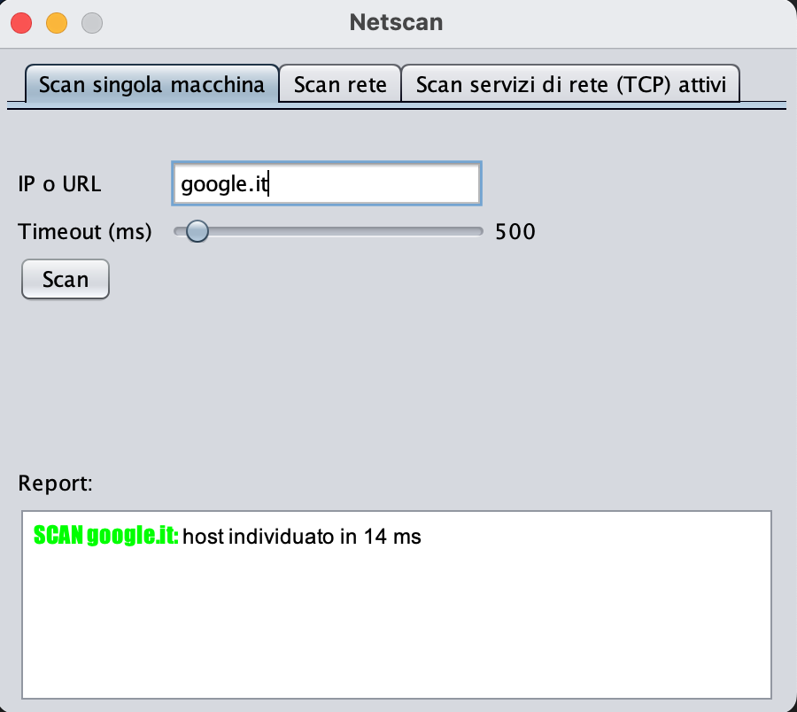
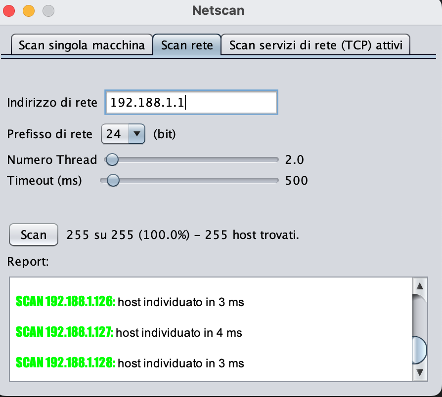
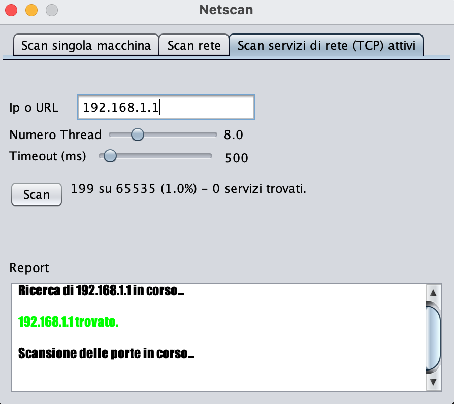

# Netscan in Java

A GUI tool to perform various types of network scans on a single machine or a network. The type of scans performed are:

- Single host scan: Determines whether a specified host is reachable.
- Network scan: Determines the number of reachable hosts on the same network.
- TCP service scan: Determines the service being provided on a specific port.

## Build and Run

To build and run the project, follow these steps:

1. Make sure you have Java 14 installed on your machine.
2. Clone this repository to your local machine.
3. Open IntelliJ IDEA and import each project: client_chat and server-chat as disticnt projects.
4. For each project use Java 14:
   1. Go to File > Project Structure.
   2. Under Project Settings, click on Project.
   3. Set the Project SDK to Java 14.
   4. Set the Project language level to 14.
   5. Click Apply and then OK.
5. Build the project by clicking on the Build button or using the shortcut key Ctrl + F9.
6. Run the server by running the Main class.